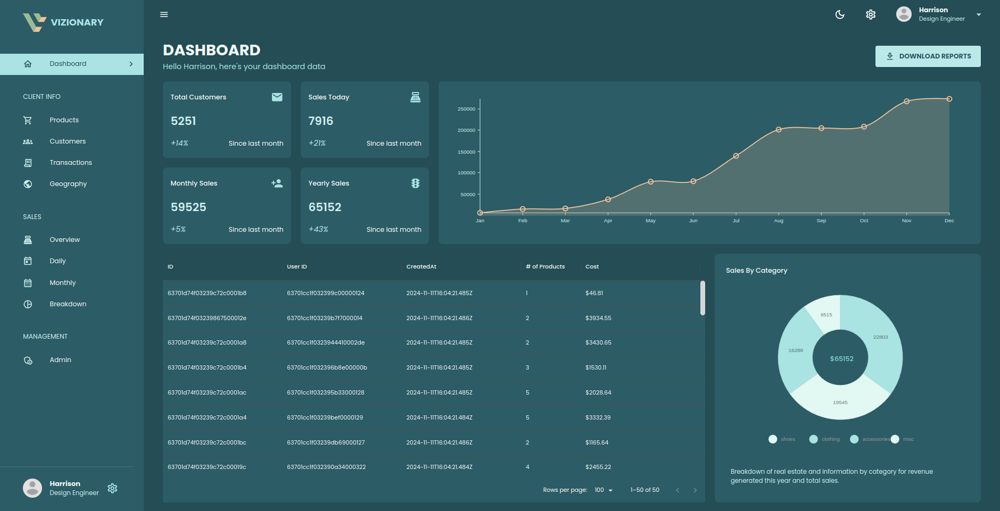
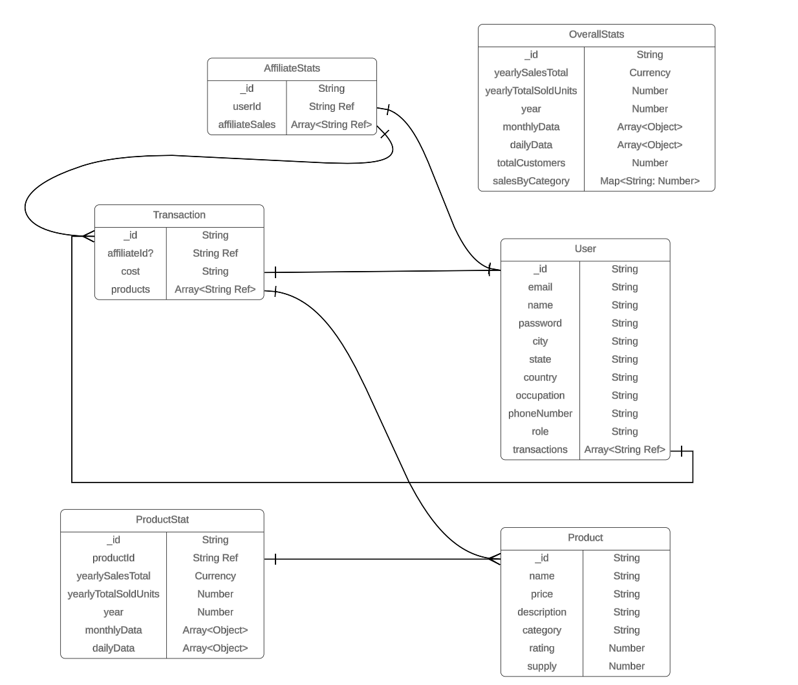
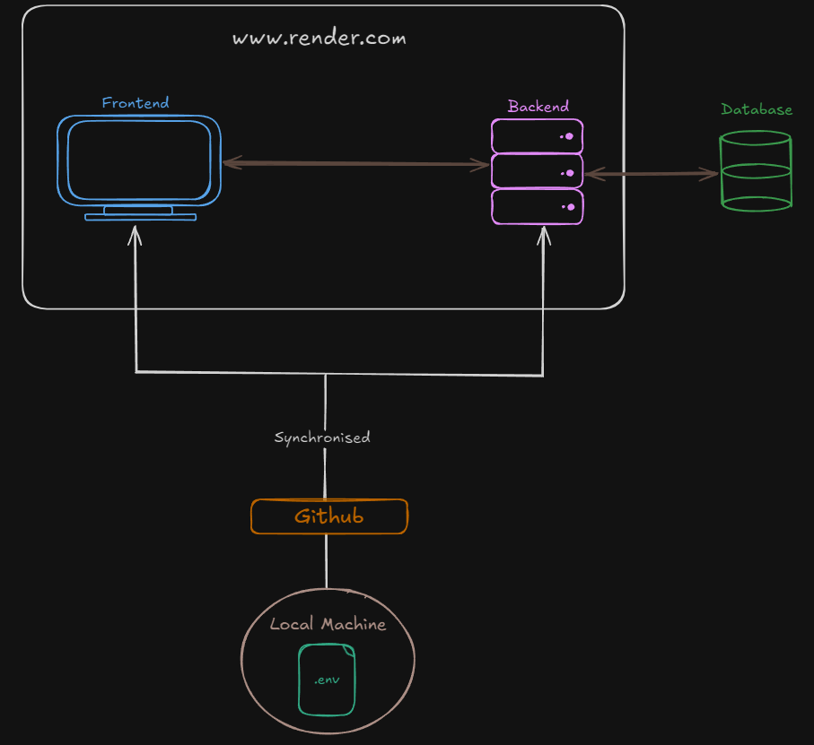

# Vizionary

**Vizionary** is a comprehensive full-stack admin dashboard application built with the MERN stack. It offers an intuitive and interactive interface for data visualization and management, making it ideal for analytical and administrative tasks.

## Screenshot



## Table of Contents
- [Project Overview](#project-overview)
- [Features](#features)
- [Technologies Used](#technologies-used)
- [Getting Started](#getting-started)
- [Setup](#setup)
- [License](#license)

---

## Project Overview

Vizionary is an admin dashboard that provides dynamic data visualization capabilities and smooth data management. It integrates frontend tools for state management, charting, and styling, along with a backend powered by Node.js, Express, and MongoDB.

## Features

- **Dynamic Data Grid**: Customizable data tables powered by Material UI
- **Interactive Charts**: Visualize data using Nivo charts
- **State Management**: Seamless state handling with Redux Toolkit
- **API Integration**: Efficient data fetching and mutation with RTK Query
- **Scalable Backend**: RESTful API built with Node.js, Express, and MongoDB

## Data Model


## Deployment


## Technologies Used

### Frontend
- **React**: For Frontend
- **Material UI**: For UI styling and DataGrid
- **Nivo**: For interactive and customizable charts
- **Redux Toolkit**: For efficient state management
- **RTK Query**: For API calls

### Backend
- **Node.js**: For Backend
- **Express.js**: Backend Framework
- **Mongoose**: For MongoDB object modeling

## Getting Started

### Prerequisites

Ensure you have the following installed/setup:
- **Node.js**
- **MongoDB**

### Setup

1. **Clone the repository**
   ```bash
   git clone https://github.com/your-username/vizionary.git
   cd vizionary

2. **Install dependencies**

   For both frontend and backend:

   ```bash
   npm install
   ```
   or
   ```bash
   npm i
   ```

4. **Environment Variables**

   Create a `.env` file in the root directory and add necessary environment variables:

   ```bash
   MONGO_URI=your_mongodb_connection_string
   PORT=5000


5. **Run the application**

   For both frontend and backend:

   ```bash
   # Start backend server
    npm run dev
   # Start frontend
    npm run start


The application should now be accessible at `http://localhost:3000`.

## Setup

- **Dashboard**: Provides an overview of key metrics
- **Data Visualization**: Dynamic charts for in-depth data analysis
- **Data Management**: Manage and interact with data through forms and tables

## License
Distributed under the `MIT License`.
